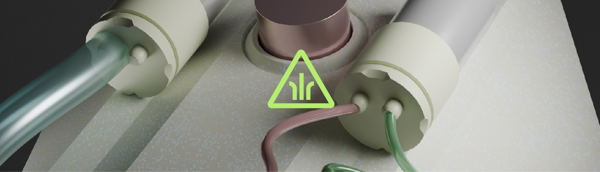
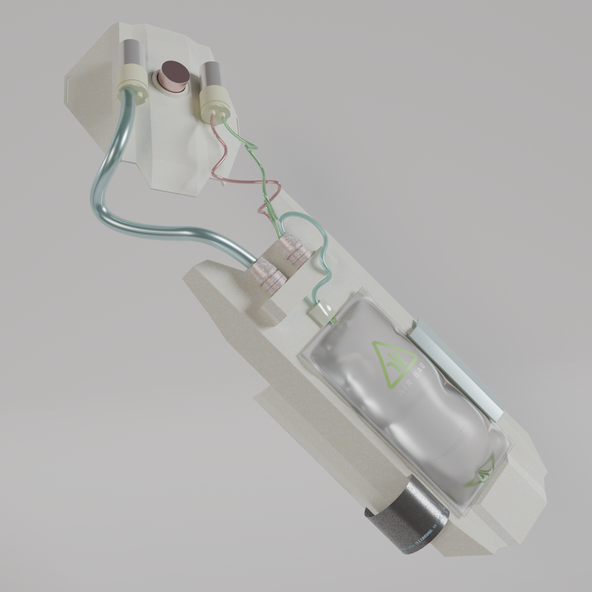

# Second-Skin_VR_Sensory_Development
"This project embodies posthumanism in VR—combining sight, sound, and touch to blur the line between humans and machines, creating a truly immersive interactive experience. Thank you for exploring Second skin Immersion with me."

## Project Content [Video](Elment2_ProjectVideo.mp4)
- Virtual Part develop with Unreal Engine 5.4.2
- Physical Part develop with Arduino (ESP32 DEV)
- 3D Print with Blender

## Second-Skin

-----------------------------------------------------------------------------
### "Second-Skin" DOCUMENT NOTES
- As the project is developed on UE5, the project files are additionally stored in ONEDRIVE (UAL accounts only)
  ["UE5.4 ORIGINAL FILE" (Onedrive)](https://artslondon-my.sharepoint.com/:f:/g/personal/tingfeng0320231_arts_ac_uk/EhQ-PnHYo2RLnmQK01zt8dMBuCSFXd_3z7ne6hNZhla2BA)
- The plugin used to assist the UE with the arduino is ["Serial Com" (Github)](https://github.com/videofeedback/Unreal_Engine_SerialCOM_Plugin)

## Project Core Document (Releases):

SerialCOM_test for Unreal Engine 5.4.2 (With Blueprint Example)
(https://github.com/leviat0925/Second-Skin_VR_Sensory_Development/tree/main/UE_ARDUINO_SERIALCOM_TEST)

SerialCOM_test for Arduino
(https://github.com/leviat0925/Second-Skin_VR_Sensory_Development/tree/main/ArduinoCode_SerialCOM)

VR Control for Unreal Engine 5.4.2 (With Blueprint)
(https://github.com/leviat0925/Second-Skin_VR_Sensory_Development/tree/main/VRTemplate)

VR Pawn with flashlight function for Unreal Engine 5.4.2 (With Blueprint)
(https://github.com/leviat0925/Second-Skin_VR_Sensory_Development/tree/main/VR_FlashLight_UE5.4)

Air Bag system model (only demo version)
(https://github.com/leviat0925/Second-Skin_VR_Sensory_Development/tree/main/AirBag_Perspective)

Air Bag system model (3D print version)
(https://github.com/leviat0925/Second-Skin_VR_Sensory_Development/blob/main/size.blend)

## Weekly weblog Document (Releases):
I edited my weekly report in notion, if you want to access the web version use the following link：
["Second Skin Weblog" (Notion)](https://sordid-melon-2e0.notion.site/My-Second-Skin-The-exploration-on-Sensory-Reconstruction-with-the-perspective-of-Posthumanism-Arts--153cabca586180cb9db6de812edd86d1)

"Second Skin weekly Weblog" (PDF)
(https://sordid-melon-2e0.notion.site/My-Second-Skin-The-exploration-on-Sensory-Reconstruction-with-the-perspective-of-Posthumanism-Arts--153cabca586180cb9db6de812edd86d1)

## Photo Doucument:

The project contains a large number of images as well as video recordings, which are stored using onedrive because of their size, for access please use the link below(only UAL access):
["Photo Document" (Onedrive)](https://artslondon-my.sharepoint.com/:f:/g/personal/tingfeng0320231_arts_ac_uk/EumVi0r-ZgZEv1hF4ini4OUBhQ3-uU5_8ZZeLZ4jgZVjwA)

-----------------------------------------------------------------------------
- ### Project Serial Communication Using information:

["Serial Communication" (Wikipedia)](https://en.wikipedia.org/wiki/Serial_communication)

["Flow Control" (Wikipedia)](https://en.wikipedia.org/wiki/Flow_control_(data))

["Software Flow Control (XON/XOFF)" (Wikipedia)](https://en.wikipedia.org/wiki/Software_flow_control)

["Serial Communication" (Contec)](https://www.contec.com/support/basic-knowledge/daq-control/serial-communicatin/)

["Serial Communication" (Sparkfun)](https://learn.sparkfun.com/tutorials/serial-communication/all)

["Serial Communication" (Adafruit)](https://learn.adafruit.com/circuit-playground-express-serial-communications/what-is-serial-communications)

["RS-232 vs TTL Serial Communication" (Sparkfun)](https://www.sparkfun.com/tutorials/215)

-----------------------------------------------------------------------------
- ### Using Plugins(UE5.4):

["VR Expansion Plugin" ](https://vreue4.com/)

["OpenXR" ](https://mbucchia.github.io/OpenXR-Toolkit/)

["Unreal Engine 5.4.x for Meta Quest VR" (UE5)](https://dev.epicgames.com/community/learning/tutorials/y4vB/unreal-engine-5-4-x-for-meta-quest-vr)

["Unreal Engine 5 Platform SDK" (Meta quest)]([https://www.contec.com/support/basic-knowledge/daq-control/serial-communicatin/](https://developers.meta.com/horizon/downloads/unreal))

["Meta XR Interaction SDK Unreal" (Meta quest)](https://developers.meta.com/horizon/downloads/package/meta-xr-interaction-sdk-unreal)

-----------------------------------------------------------------------------
- ### Using Plugins(Blender):

["Machine3" ]([https://developers.meta.com/horizon/downloads/package/meta-xr-interaction-sdk-unreal](https://machin3.io/))

